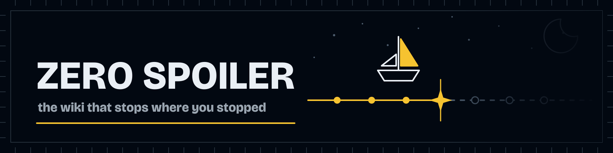
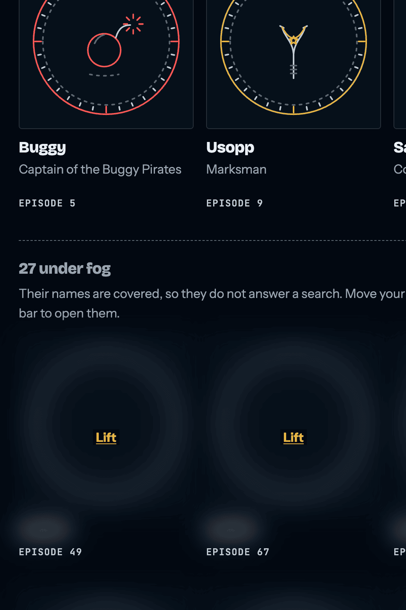
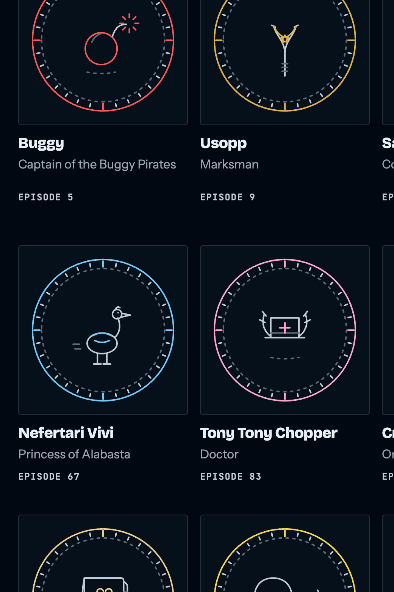
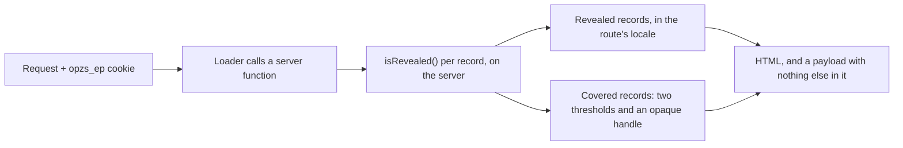
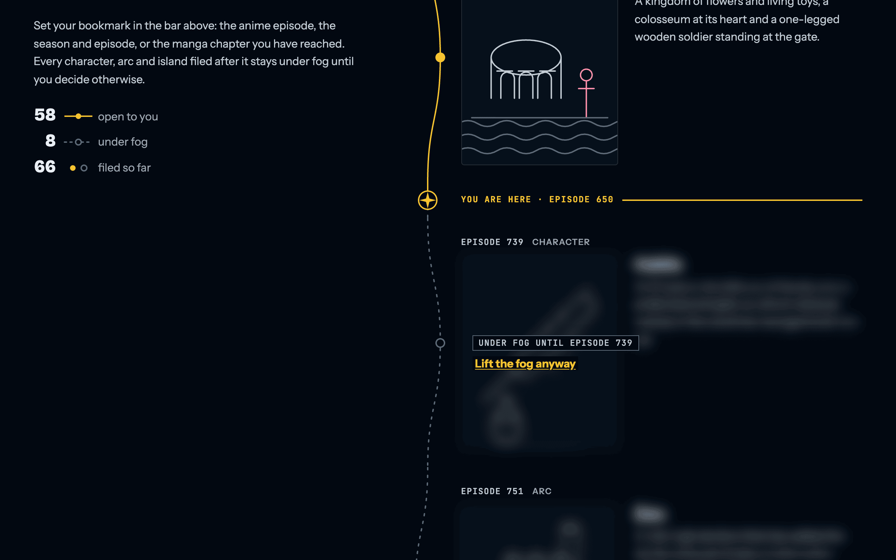
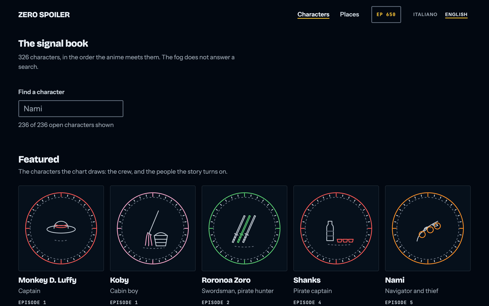
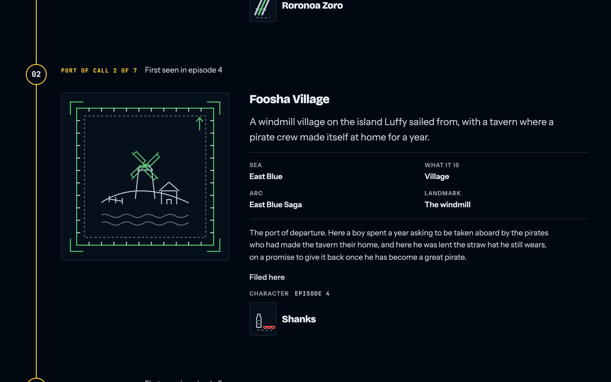
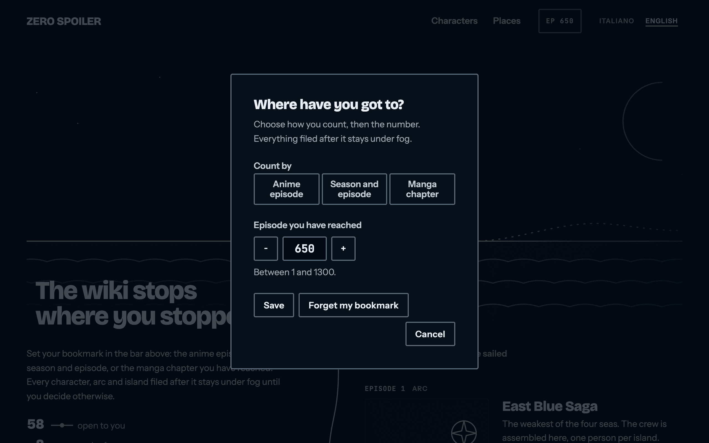

<p align="center">
  
</p>

<p align="center">
  <strong>A One Piece wiki that hides every record filed later than the point you have reached.</strong>
  <br>
  React 19 · TanStack Start (SSR) · StyleX · TypeScript strict · 5 runtime dependencies
</p>

<p align="center">
  <a href="https://one-piece-zero-spoiler.netlify.app/en/characters"><strong>Live demo</strong></a>
  ·
  <a href="https://github.com/cosimochellini/one-piece-zero-spoiler/releases/latest">Releases</a>
  ·
  <a href="https://github.com/cosimochellini/one-piece-zero-spoiler/actions/workflows/ci.yml">CI</a>
</p>

<p align="center">
  <a href="https://github.com/cosimochellini/one-piece-zero-spoiler/actions/workflows/ci.yml"></a>
  <a href="https://github.com/cosimochellini/one-piece-zero-spoiler/releases/latest"></a>
  <a href="https://app.netlify.com/sites/one-piece-zero-spoiler/deploys"></a>
  <a href="LICENSE"></a>
</p>

## The page arrives already censored

Every wiki about a long story is a minefield. You look up one character and the
sidebar tells you who dies, who betrays whom, and what the hat is for. This one
asks a single question — where have you got to? — and files everything past that
point under fog.

The same page, same viewport, same scroll offset. Only the bookmark changed.

| Bookmark at episode 45                                                                                                                       | Bookmark at episode 650                                                                                                        |
| -------------------------------------------------------------------------------------------------------------------------------------------- | ------------------------------------------------------------------------------------------------------------------------------ |
|  |  |

The interesting part is that this is not a blur on top of a full page. The
covered names never reach the browser. Ask the live site for a character you
have not met yet, with no bookmark set:

```sh
curl -s https://one-piece-zero-spoiler.netlify.app/en/characters/trafalgar-law \
  | grep -c 'Trafalgar Law'
# 0

curl -s https://one-piece-zero-spoiler.netlify.app/en/characters/trafalgar-law \
  | grep -o '<title>[^<]*</title>'
# <title>A character under fog — Zero Spoiler</title>
```

Send the same request with `Cookie: opzs_ep=650` and the count is `1` and the
title is the name. The decision is taken once, on the server, before the
document exists — and the records it decides against never leave the server at
all:



The archive is 484 records and 485 line drawings — about 900 KB of TypeScript.
None of it is compiled into the client bundle. A route loader reads the cookie
out of the request and sends back the records at or below the bookmark, with
their strings already resolved to the page's locale and their drawings already
resolved to stroke paths. A record the reader has not reached crosses the wire
as two numbers and an opaque handle:

```ts
export type CoveredRecord = {
  readonly handle: string
  readonly kind: EntityKind
  readonly revealedAtEpisode: number
  readonly revealedAtChapter: number
}
```

No id, because the id is the name slug: `/characters/trafalgar-law` in a `key`,
an `href` or a DOM `id` spells the name the fog is for. The handle is the
record's index in one canonical order, written in base 36, and the index-to-id
table exists only in the server bundle.

Every covered surface is a placeholder rather than a blur over the real thing: a
bare seal, the word "Spoiler", and the threshold, because "something opens at
episode 392" is the promise and not the spoiler. The covered text is not in the
DOM for find-in-page to turn up, and it is not in the payload behind it either.

The cost is one round trip. Moving the bookmark used to be instant because every
record was already in the browser; it is now a request, made inside a
`useTransition` so the page the reader is looking at — already correct, already
censored — stays on screen until the new one is ready, and the horizon line and
the records it divides commit together.

The search field obeys the same rule, and now by construction rather than by
discipline: a covered character is not on the page to be searched. It matches
only the epithets the reader has already reached — so "Whitebeard" finds Edward
Newgate after episode 152 and not before — and those are gated on the server and
sent already folded, so an epithet the reader has not reached is not in the
browser at all rather than there and declined.

## Aboard

|                                                                                                                                                                                                                           |                                                                                                                                                                                                                |
| ------------------------------------------------------------------------------------------------------------------------------------------------------------------------------------------------------------------------- | -------------------------------------------------------------------------------------------------------------------------------------------------------------------------------------------------------------- |
| <br>The landing chart: open waypoints in gold above your position, fogged ones dashed below. | <br>The signal book: 326 characters, each with its own crest.                       |
| <br>The ship's log: ports of call down one spine, each with a plate and a dossier.                                      | <br>The bookmark dialog: the three grammars as an actual control. |

## The archive, in numbers

| Thing               | Count                                                                 |
| ------------------- | --------------------------------------------------------------------- |
| Records             | 484                                                                   |
| Characters          | 326                                                                   |
| Devil fruits        | 120                                                                   |
| Arcs, places, ships | 29 · 7 · 2                                                            |
| Sagas               | 11                                                                    |
| Line drawings       | 485: one per record, and one redrawn from episode 421                 |
| Test files          | 63                                                                    |
| Test cases          | 539                                                                   |
| Coverage            | 95.7 % statements, 93.8 % branches, 95.4 % functions (last local run) |

## Every line drawn here

Toei and Shueisha own every frame of the anime and every panel of the manga, so
none of it ships and nothing is hotlinked. Every record instead has a line
drawing made for this project: a straw hat, three sheathed swords, a violin, a
windmill on a hill. No faces, no logos, no official artwork.

The drawings are data, not markup — lists of stroke paths in TypeScript — and
one component renders all of them: a 160×200 box, a uniform 2 px stroke held at
2 px through `vector-effect: non-scaling-stroke`, round caps and joins, no
fills. Each takes exactly one hue for its main stroke and leaves the rest in the
neutral ink, which is what makes several hundred illustrations read as one set.
A drawing can be dated like a dossier fact: a record the story changes is drawn
again from the episode it changes in, and the server picks the latest drawing
the reader's bookmark has reached, so the object that stands for a character
never says what the reader has not yet seen. The compositions around them went
the same way: the fold's night sea, the seal a character's crest is set into, a
port's chart plate, the route's own line and compass mark are all stroke lists
under `src/data/art/` too, so no line on the site is written in JSX. The one
solid on the site is the ship in the fold: the Thousand Sunny cut out of a full
moon as a silhouette, with a hairline of the route gold around her profile,
because a ship the size of a headline drawn in outline read as a diagram of a
ship.

The 120 devil fruits are the one set that is grown rather than drawn one at a
time. A hundred and twenty drawings of the same object have to read as one set
and still be a hundred and twenty drawings, so each one is composed from a seed
written beside its id — one of six silhouettes, one of four marks, a stalk and a
leaf — and the eleven a reader arrives already knowing are drawn by hand and
override theirs. The containment is a proof rather than a hope: a seed cannot
supply a radius, so the widest fruit the generator can produce is known in
advance, and every path it writes uses absolute commands only, which is what
lets the test read the numbers in a path as coordinates.

## Stack

| Layer     | Choice                                            |
| --------- | ------------------------------------------------- |
| UI        | React 19.3.0                                      |
| Framework | TanStack Start 1.168.52 (SSR, file-based routes)  |
| Router    | TanStack Router 1.170.35                          |
| Styling   | StyleX 0.19.0, compiled to one same-origin sheet  |
| Build     | Vite 8.3.0                                        |
| Language  | TypeScript 6.0.3, `strict` plus nine extra flags  |
| Tests     | Vitest 5.0.0, jsdom, Testing Library              |
| Lint      | ESLint 10 flat config, 1,020 rules on, type-aware |
| Gates     | react-doctor 0.9.14, fallow 3.25.0                |
| Host      | Netlify, SSR function plus CDN assets             |
| Runtime   | Node 24.18.0, npm 11.20.0                         |

**Five runtime dependencies**, and every version is pinned exact — no ranges,
one documented `overrides` entry.

## The invariants are tests

The archive is TypeScript modules rather than JSON, so most mistakes are not
runtime mistakes at all:

- `ArtId` is derived from the drawings themselves, so a record cannot name a
  drawing that does not exist.
- The English dictionary defines the key set and the Italian one is typed
  against it, so a missing translation fails `typecheck`.
- The bookmark is a discriminated union read through an exhaustive switch, under
  `noFallthroughCasesInSwitch`.
- `strict` plus nine further flags are on — `noUncheckedIndexedAccess`,
  `exactOptionalPropertyTypes` and `noPropertyAccessFromIndexSignature` among
  them — and the four `eslint-disable` comments in the whole tree each name
  their rule and give a reason, because the lint rejects one that does not.

What the compiler cannot hold, the test suite does. These are editorial
invariants, checked on every run:

- nothing in a payload names a record the reader has not reached, no handle can
  be read back into a name, and a covered record carries no id — checked over
  all 356 of them, because one handle that happened to be `btoa(id)` would undo
  the whole arrangement;
- ids are unique, thresholds sit inside the allowed range, and every record is
  translated in both locales;
- a record's drawing is its own, never borrowed from another record;
- every dossier timeline ascends and starts no earlier than the record's own
  threshold, so a fact can never predate the character it belongs to;
- a chronicle's stories name only characters filed no later than the story's own
  episode — the links the server builds from `[[id]]` markers, and the plain
  words around them, checked against every later record's name in both locales —
  so a story a reader has reached can never introduce them to someone they have
  not met;
- every place is filed under an arc that opens no later than the place itself,
  because the dossier names that arc in the open;
- no drawing is left without a record;
- every devil fruit opens no later than any dossier entry that names it, which
  is what lets a character's page print its fruit as a link without checking
  anything — and the eighteen fruits whose chapter threshold rounds the wrong
  way are pinned in a list, so a nineteenth is a decision somebody takes rather
  than one that happens.

The one I like most is self-referential: the pull request title validator reads
the release configuration and asserts that the two accept exactly the same set
of commit types. Drift between them would merge cleanly and then release
nothing, so it fails as a test instead.

## Accessibility, security, performance

### Accessibility

- A skip link, and a native `<dialog>` opened with `showModal()` — top layer,
  page inert, Escape closes, focus returns to where it came from.
- Covered content carries `inert` and `aria-hidden`, so neither Tab nor a screen
  reader can walk into a spoiler.
- The reader's position on the chart is `aria-current="step"`.
- Contrast is measured and recorded beside the tokens: 17.4:1 for body ink,
  12.2:1 for the accent.

### Security

- A per-request nonce Content Security Policy, `default-src 'self'`,
  `object-src 'none'`, `frame-ancestors 'none'`, plus HSTS, Referrer-Policy and
  Permissions-Policy.
- The headers live in the app, not in `netlify.toml`, because Netlify does not
  apply file headers to responses produced by a function — and every document
  here is server-rendered by one.
- In CI the pull request title reaches the validator through the environment,
  never through template interpolation, because a title is attacker-controlled.
- The server functions that serve the archive sit behind a CSRF middleware, so
  another origin cannot ask them on a reader's behalf.

**What the fog is and is not.** It hides the story from someone reading the
site, and it is honest about the rest. The "lift the fog anyway" control is a
deliberate escape hatch: it asks the server for one record, by handle, and a
script could walk every handle on a page and rebuild the archive in a few
hundred requests. What changed is the shape of that: it used to be one `curl` of
a cacheable, crawlable static asset, and it is now same-origin POSTs to a
function — logged, rate-limitable, and not something a search engine indexes on
its own.

**And a search engine is served the whole thing.** A crawler sends no bookmark,
so left alone it would index four hundred and forty-six pages that all say "a
character under fog". A request whose `User-Agent` names one of the fourteen
known crawlers and unfurlers — Googlebot, Bingbot, Applebot, the two Yandex and
Baidu bots, and the link previewers of Slack, Discord, WhatsApp and the rest —
is therefore read as a reader who has finished the story, and gets the archive
open. That is a deliberate trade and it is worth saying plainly: a user agent is
a string anyone can send, so `curl -A Googlebot` reads the whole wiki. The fog
is an editorial promise to someone reading the site, not an access control, and
this is the place that is most visible. WhatsApp is the one name matched only at
the start of the string: its unfurler leads with it, while its in-app browser
appends the same token to an ordinary mobile browser's, and behind that one is a
reader who tapped a link a friend sent.

### Performance

- **The archive is not in the bundle.** Moving it behind the loaders took the
  client JavaScript from 1,048,559 bytes to 450,058 — and 318 KB of what is left
  is React. A reader at episode 45 downloads the ten records they have reached,
  not all 484. Adding the 120 devil fruits, their drawings and two more pages
  cost 31 KB of client JavaScript and not one byte of archive.
- Payloads carry one locale. A record used to ship its Italian and English name
  and summary side by side; it now carries the page's own.
- The shelves — 326 tiles with a drawing each, below the fold — are returned
  from the loader as an un-awaited promise and stream into a `<Suspense>`
  boundary, so the search field and the crests above them are up first. The
  landing chart, the ship's log and a character's dossier are awaited instead:
  they are the page, and a reader with scripting off should get them whole.
- Search runs on names folded once by the server, so a keystroke costs one
  folded query and a few hundred `indexOf` calls, and the list behind the field
  is deferred while the field itself never is.
- Three self-hosted variable font families, five woff2 files, each with a
  metric-matched fallback face so the `font-display: swap` handover does not
  reflow the page.
- Immutable one-year cache headers on assets and fonts. The archive's own
  responses vary by cookie and are never shared-cached.

### Localization

Italian and English, as route prefixes: `/it` and `/en`. The root negotiates
once — cookie, then `Accept-Language`, then Italian — and redirects with a 302,
never a 301. An unrecognised prefix is a 404 rather than a silent redirect.
Character names are the Italian dub's in Italian.

## Running it locally

Node 24.18.0 and npm 11.20.0, both pinned.

```sh
nvm use
npm install
npm run dev     # http://localhost:3000
```

`npm install` also lays down the git hooks, through the `prepare` script rather
than a dependency's postinstall, so they arrive on a plain install without the
project allowing install scripts. `LEFTHOOK=0 git commit` skips them for one
command.

| Script                                      | Does                                            |
| ------------------------------------------- | ----------------------------------------------- |
| `npm run dev`                               | Dev server                                      |
| `npm run build`                             | Production build                                |
| `npm start`                                 | Serve the production build                      |
| `npm run typecheck`                         | `tsc --noEmit`                                  |
| `npm run lint` / `lint:fix`                 | ESLint, type-aware, zero warnings allowed       |
| `npm run format` / `format:check`           | Prettier                                        |
| `npm test` / `test:watch` / `test:coverage` | Vitest                                          |
| `npm run gate:react-doctor`                 | Blocking react-doctor health gate               |
| `npm run gate:fallow`                       | Blocking fallow codebase-intelligence gate      |
| `npm run gate:archive`                      | Blocking gate: the archive is not in the bundle |
| `npm run check`                             | All of the above, in the order CI runs it       |

`npm run check` is the gate. Run it before pushing.

The hooks sit in front of it, never in place of it: `pre-commit` formats and
lints the staged files and typechecks the whole project, `commit-msg` runs
commitlint, `pre-push` runs the suite. Each sees a subset of what
`npm run check` does, and CI skips all three with `LEFTHOOK=0` because it runs
the whole thing anyway.

## Engineering notes

**The pull request title is the version bump.** Merges to `main` are squashed
into one commit whose subject is the title, and semantic-release reads that
subject to cut the tag and the GitHub Release. Every conventional type maps to a
release on purpose, so a merged pull request always produces a version. There is
no `CHANGELOG.md`; the Releases page is the changelog.

**Three blocking gates beyond lint and test.** react-doctor and fallow run last,
after typecheck, lint, format, test and build, locally and in CI, and neither
leaves itself a way to shrug. Every react-doctor finding blocks whatever tag it
carries, its configuration is now a typed `doctor.config.ts`, and it runs with
inline disables ignored, so a comment cannot walk a finding past the gate. The
third is `scripts/archive-gate.mjs`, and it exists because nothing else can see
the failure it looks for: one stray value import from `~/data` typechecks,
lints, passes every test and passes both other gates, and the only symptom is a
bigger `.js` file that a visitor with no bookmark can read end to end. It greps
the built client chunks for a sentence out of every saga and out of the ship's
log, read at gate time so it cannot go stale, and never a key such as
`revealedAtEpisode`, which legitimately survives on a covered record. The
drawing modules carry no sentences — they are keyed by record id, and a record's
id is its name slug — so those are looked for by id instead, which is the shape
a leak there would take. A byte ceiling on the whole client payload catches bulk
arriving through a shape neither pattern matches. ESLint catches the same
mistake one step earlier, at the import.

fallow watches the shape of the codebase instead, with nearly every rule it has
raised to error: eight zones with a declared import direction between them, no
block of eight lines or more duplicated, and ceilings of 8 cyclomatic, 8
cognitive and 60 lines per unit. Both write a machine-readable report that CI
uploads as an artifact on every run, red or green.

**A thousand rules, not four presets.** `eslint --print-config` on a source file
reports 1,020 rules switched on. The bulk of them are unicorn's 328 and
sonarjs's 216, then typescript-eslint's type-aware sets, `@eslint-react`,
regexp, jsdoc and jsx-a11y-x; `eslint-config-prettier` is applied last, so the
two tools cannot disagree about where a character sits. Over the families sit
explicit ceilings — complexity 8, cognitive complexity 10, 60 lines a function,
300 a file, 15 statements, 3 parameters, 3 levels of nesting — sized for what a
reviewer holds in their head at once rather than as a target to grow into. And a
suppression has to earn itself: `require-description` means an `eslint-disable`
names its rule and states a reason, `no-unused-disable` fails it once the reason
is gone. Four exist in the tree.

**The commit type list has one home.** The hooks run through lefthook, one
declarative file with globs, `{staged_files}` and re-staging built in, rather
than a committed shell script per hook plus lint-staged on top. `commit-msg`
puts the message through commitlint, and commitlint's config imports
`TYPE_BUMPS` and `MAX_TITLE_LENGTH` from `scripts/validate-pr-title.mjs` instead
of repeating them — the header cap is the pull request title cap, because a
squash merge turns that title into the subject. The validator is itself asserted
against `.releaserc.json`, so all three corners stay in lockstep by
construction, and a parity test spawns the same commitlint binary the hook runs
to check the import is what the tool ends up enforcing.

**Two Vite configs, on purpose.** The Vitest config deliberately omits the
TanStack Start plugin: it forces `optimizeDeps.include` for React, which
prebundles a second copy under Vitest and nulls the hook dispatcher. Vitest
gives its own config full priority rather than merging the two, so this is real
isolation. StyleX has to stay registered in both, because its `create` throws at
runtime when it has not been compiled.

**One dependency override.** StyleX's plugin and TanStack's router plugin
declare disjoint peer ranges for `unplugin`, so a clean install fails with
`ERESOLVE`. The override pins every copy to the version TanStack already
requires. It goes away once StyleX widens its range.

## Built with Claude Code

This project was built in agentic sessions with
[Claude Code](https://claude.com/claude-code), and the interesting part is not
that a model wrote code — it is that the guardrails were built first, so its
output could be accepted or rejected mechanically rather than on trust.

Nothing reaches `main` that has not passed a type-aware lint of a thousand-odd
rules at zero warnings, 337 tests including the editorial invariants above, a
production build, and three blocking quality gates. Pull requests go through
review loops run by subagents, and every finding is either fixed in scope or
filed as an issue. Even the release metadata is checked by a test rather than by
memory.

The same discipline is why the architecture decisions live in code comments next
to the code they explain, and why this README is short.

## Charted next

- [ ] Verify the manga chapter thresholds against a source. They were filed from
      memory and are marked for a check.
- [ ] More ports in the ship's log — 7 places carry full dossiers today, across
      29 filed arcs.
- [ ] Chronicles for the rest of the featured list — 12 of the 36 carry one
      today, the crew and the two figures the first half turns on. The episode
      each story is filed at is recorded in
      [`docs/chronicle-verification.md`](docs/chronicle-verification.md).

## License

[MIT](LICENSE) © 2026 Cosimo Chellini.

One Piece is created by Eiichiro Oda and owned by Shueisha and Toei Animation.
This is an unofficial, non-commercial fan project: it contains no official
artwork, no scans and no frames, and it is not endorsed by the rights holders.

Built by [Cosimo Chellini](https://github.com/cosimochellini).
