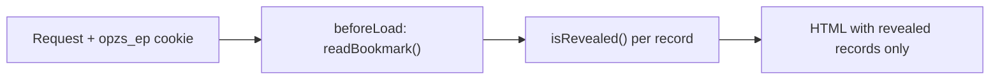

<p align="center">
  
</p>

<p align="center">
  <strong>A One Piece wiki that hides every record filed later than the point you have reached.</strong>
  <br>
  React 19 · TanStack Start (SSR) · StyleX · TypeScript strict · 5 runtime dependencies
</p>

<p align="center">
  <a href="https://one-piece-zero-spoiler.netlify.app/en/characters"><strong>Live demo</strong></a>
  ·
  <a href="https://github.com/cosimochellini/one-piece-zero-spoiler/releases/latest">Releases</a>
  ·
  <a href="https://github.com/cosimochellini/one-piece-zero-spoiler/actions/workflows/ci.yml">CI</a>
</p>

<p align="center">
  <a href="https://github.com/cosimochellini/one-piece-zero-spoiler/actions/workflows/ci.yml"></a>
  <a href="https://github.com/cosimochellini/one-piece-zero-spoiler/releases/latest"></a>
  <a href="https://app.netlify.com/sites/one-piece-zero-spoiler/deploys"></a>
  <a href="LICENSE"></a>
</p>

## The page arrives already censored

Every wiki about a long story is a minefield. You look up one character and the
sidebar tells you who dies, who betrays whom, and what the hat is for. This one
asks a single question — where have you got to? — and files everything past that
point under fog.

The same page, same viewport, same scroll offset. Only the bookmark changed.

| Bookmark at episode 45                                                                                                                       | Bookmark at episode 650                                                                                                        |
| -------------------------------------------------------------------------------------------------------------------------------------------- | ------------------------------------------------------------------------------------------------------------------------------ |
|  |  |

The interesting part is that this is not a blur on top of a full page. The
covered names never reach the browser. Ask the live site for a character you
have not met yet, with no bookmark set:

```sh
curl -s https://one-piece-zero-spoiler.netlify.app/en/characters/trafalgar-law \
  | grep -c 'Trafalgar Law'
# 0

curl -s https://one-piece-zero-spoiler.netlify.app/en/characters/trafalgar-law \
  | grep -o '<title>[^<]*</title>'
# <title>A character under fog — Zero Spoiler</title>
```

Send the same request with `Cookie: opzs_ep=650` and the count is `1` and the
title is the name. The decision is taken once, on the server, before the
document exists:



```ts
export const readBookmark: () => Bookmark = createIsomorphicFn()
  .server((): Bookmark => parseBookmark(getCookie(EPISODE_COOKIE)))
  .client((): Bookmark =>
    parseBookmark(parseCookieHeader(document.cookie).get(EPISODE_COOKIE)),
  )
```

That runs in `beforeLoad` of the root route, so the first paint is already
correct. Reading the cookie in an effect would paint the uncovered page and
cover it one frame later, which is itself the spoiler.

Two ways of hiding, picked per surface:

- **Blur plus `inert` and `aria-hidden`** on the route chart, where the covered
  text stays in the DOM but is unreachable by keyboard, screen reader or
  drag-select.
- **A placeholder** on character and place pages, where the covered name is
  absent from the served HTML entirely and only mounts on the client once the
  fog is lifted. A covered card also carries no link, because the slug would
  spell the name.

## Where you are is where the fog starts

The bookmark lives in one cookie, `opzs_ep`, and it has three grammars, because
readers count in three different units:

| Value   | Means               |
| ------- | ------------------- |
| `650`   | anime episode 650   |
| `s2e3`  | season 2, episode 3 |
| `c1044` | manga chapter 1044  |

Parsing fails closed. A missing cookie, a corrupt one, or a number outside
1–1300 hides everything rather than revealing it.

Every record carries two thresholds, `revealedAtEpisode` and
`revealedAtChapter`. A chapter bookmark is read against the chapter, an episode
or season bookmark against the episode, and a season is resolved to an absolute
episode through a table of the 22 anime seasons. There is no conversion between
units: a reader picks one, and every threshold on the site is then stated in
that unit.

Ordering follows the reader's unit too, which matters more than it sounds.
Shanks is on the first page of the manga but appears in the fourth episode of
the anime, so a list sorted by episode is not the same list sorted by chapter.
Sorting per unit is what keeps the open records a contiguous prefix, which in
turn lets the reader's position be a single row on the chart rather than a
marker interpolated along a path.

The search field obeys the same rule. It filters open characters only, and it
matches only the epithets the reader has already reached — so "Whitebeard" finds
Edward Newgate after episode 152 and not before. A covered card that appeared
when its name was typed would confirm the name.

## Aboard

|                                                                                                                                                                                                                           |                                                                                                                                                                                                                |
| ------------------------------------------------------------------------------------------------------------------------------------------------------------------------------------------------------------------------- | -------------------------------------------------------------------------------------------------------------------------------------------------------------------------------------------------------------- |
| <br>The landing chart: open waypoints in gold above your position, fogged ones dashed below. | <br>The signal book: 326 characters, each with its own crest.                       |
| <br>The ship's log: ports of call down one spine, each with a plate and a dossier.                                      | <br>The bookmark dialog: the three grammars as an actual control. |

## The archive, in numbers

| Thing               | Count                                                                 |
| ------------------- | --------------------------------------------------------------------- |
| Records             | 356                                                                   |
| Characters          | 326                                                                   |
| Arcs, places, ships | 21 · 7 · 2                                                            |
| Sagas               | 11                                                                    |
| Line drawings       | 356, one per record                                                   |
| Test files          | 33                                                                    |
| Test cases          | 288                                                                   |
| Coverage            | 95.7 % statements, 94.2 % branches, 95.0 % functions (last local run) |

## Every line drawn here

Toei and Shueisha own every frame of the anime and every panel of the manga, so
none of it ships and nothing is hotlinked. Every record instead has a line
drawing made for this project: a straw hat, three sheathed swords, a violin, a
windmill on a hill. No faces, no logos, no official artwork.

The drawings are data, not markup — lists of stroke paths in TypeScript — and
one component renders all 356 of them: a 160×200 box, a uniform 2 px stroke held
at 2 px through `vector-effect: non-scaling-stroke`, round caps and joins, no
fills. Each takes exactly one hue for its main stroke and leaves the rest in the
neutral ink, which is what makes several hundred illustrations read as one set.
The compositions around them went the same way: the fold's night sea, the seal a
character's crest is set into, a port's chart plate, the route's own line and
compass mark are all stroke lists under `src/data/art/` too, so no line on the
site is written in JSX.

## Stack

| Layer     | Choice                                            |
| --------- | ------------------------------------------------- |
| UI        | React 19.3.0                                      |
| Framework | TanStack Start 1.168.52 (SSR, file-based routes)  |
| Router    | TanStack Router 1.170.35                          |
| Styling   | StyleX 0.19.0, compiled to one same-origin sheet  |
| Build     | Vite 8.3.0                                        |
| Language  | TypeScript 6.0.3, `strict` plus nine extra flags  |
| Tests     | Vitest 5.0.0, jsdom, Testing Library              |
| Lint      | ESLint 10 flat config, 1,020 rules on, type-aware |
| Gates     | react-doctor 0.9.14, fallow 3.25.0                |
| Host      | Netlify, SSR function plus CDN assets             |
| Runtime   | Node 24.18.0, npm 11.16.0                         |

**Five runtime dependencies**, and every version is pinned exact — no ranges,
one documented `overrides` entry.

## The invariants are tests

The archive is TypeScript modules rather than JSON, so most mistakes are not
runtime mistakes at all:

- `ArtId` is derived from the drawings themselves, so a record cannot name a
  drawing that does not exist.
- The English dictionary defines the key set and the Italian one is typed
  against it, so a missing translation fails `typecheck`.
- The bookmark is a discriminated union read through an exhaustive switch, under
  `noFallthroughCasesInSwitch`.
- `strict` plus nine further flags are on — `noUncheckedIndexedAccess`,
  `exactOptionalPropertyTypes` and `noPropertyAccessFromIndexSignature` among
  them — and the four `eslint-disable` comments in the whole tree each name
  their rule and give a reason, because the lint rejects one that does not.

What the compiler cannot hold, the test suite does. These are editorial
invariants, checked on every run:

- ids are unique, thresholds sit inside the allowed range, and every record is
  translated in both locales;
- a record's drawing is its own, never borrowed from another record;
- every dossier timeline ascends and starts no earlier than the record's own
  threshold, so a fact can never predate the character it belongs to;
- every place is filed under an arc that opens no later than the place itself,
  because the dossier names that arc in the open;
- no drawing is left without a record.

The one I like most is self-referential: the pull request title validator reads
the release configuration and asserts that the two accept exactly the same set
of commit types. Drift between them would merge cleanly and then release
nothing, so it fails as a test instead.

## Accessibility, security, performance

### Accessibility

- A skip link, and a native `<dialog>` opened with `showModal()` — top layer,
  page inert, Escape closes, focus returns to where it came from.
- Covered content carries `inert` and `aria-hidden`, so neither Tab nor a screen
  reader can walk into a spoiler.
- The reader's position on the chart is `aria-current="step"`.
- Contrast is measured and recorded beside the tokens: 17.4:1 for body ink,
  12.2:1 for the accent.

### Security

- A per-request nonce Content Security Policy, `default-src 'self'`,
  `object-src 'none'`, `frame-ancestors 'none'`, plus HSTS, Referrer-Policy and
  Permissions-Policy.
- The headers live in the app, not in `netlify.toml`, because Netlify does not
  apply file headers to responses produced by a function — and every document
  here is server-rendered by one.
- In CI the pull request title reaches the validator through the environment,
  never through template interpolation, because a title is attacker-controlled.

### Performance

- Three self-hosted variable font families, five woff2 files, each with a
  metric-matched fallback face so the `font-display: swap` handover does not
  reflow the page.
- Immutable one-year cache headers on assets and fonts.

### Localization

Italian and English, as route prefixes: `/it` and `/en`. The root negotiates
once — cookie, then `Accept-Language`, then Italian — and redirects with a 302,
never a 301. An unrecognised prefix is a 404 rather than a silent redirect.
Character names are the Italian dub's in Italian.

## Running it locally

Node 24.18.0 and npm 11.16.0, both pinned.

```sh
nvm use
npm install
npm run dev     # http://localhost:3000
```

`npm install` also lays down the git hooks, through the `prepare` script rather
than a dependency's postinstall, so they arrive on a plain install without the
project allowing install scripts. `LEFTHOOK=0 git commit` skips them for one
command.

| Script                                      | Does                                       |
| ------------------------------------------- | ------------------------------------------ |
| `npm run dev`                               | Dev server                                 |
| `npm run build`                             | Production build                           |
| `npm start`                                 | Serve the production build                 |
| `npm run typecheck`                         | `tsc --noEmit`                             |
| `npm run lint` / `lint:fix`                 | ESLint, type-aware, zero warnings allowed  |
| `npm run format` / `format:check`           | Prettier                                   |
| `npm test` / `test:watch` / `test:coverage` | Vitest                                     |
| `npm run gate:react-doctor`                 | Blocking react-doctor health gate          |
| `npm run gate:fallow`                       | Blocking fallow codebase-intelligence gate |
| `npm run check`                             | All of the above, in the order CI runs it  |

`npm run check` is the gate. Run it before pushing.

The hooks sit in front of it, never in place of it: `pre-commit` formats and
lints the staged files and typechecks the whole project, `commit-msg` runs
commitlint, `pre-push` runs the suite. Each sees a subset of what
`npm run check` does, and CI skips all three with `LEFTHOOK=0` because it runs
the whole thing anyway.

## Engineering notes

**The pull request title is the version bump.** Merges to `main` are squashed
into one commit whose subject is the title, and semantic-release reads that
subject to cut the tag and the GitHub Release. Every conventional type maps to a
release on purpose, so a merged pull request always produces a version. There is
no `CHANGELOG.md`; the Releases page is the changelog.

**Two blocking gates beyond lint and test.** react-doctor and fallow run last,
after typecheck, lint, format, test and build, locally and in CI, and neither
leaves itself a way to shrug. Every react-doctor finding blocks whatever tag it
carries, its configuration is now a typed `doctor.config.ts`, and it runs with
inline disables ignored, so a comment cannot walk a finding past the gate.
fallow watches the shape of the codebase instead, with nearly every rule it has
raised to error: eight zones with a declared import direction between them, no
block of eight lines or more duplicated, and ceilings of 8 cyclomatic, 8
cognitive and 60 lines per unit. Both write a machine-readable report that CI
uploads as an artifact on every run, red or green.

**A thousand rules, not four presets.** `eslint --print-config` on a source file
reports 1,020 rules switched on. The bulk of them are unicorn's 328 and
sonarjs's 216, then typescript-eslint's type-aware sets, `@eslint-react`,
regexp, jsdoc and jsx-a11y-x; `eslint-config-prettier` is applied last, so the
two tools cannot disagree about where a character sits. Over the families sit
explicit ceilings — complexity 8, cognitive complexity 10, 60 lines a function,
300 a file, 15 statements, 3 parameters, 3 levels of nesting — sized for what a
reviewer holds in their head at once rather than as a target to grow into. And a
suppression has to earn itself: `require-description` means an `eslint-disable`
names its rule and states a reason, `no-unused-disable` fails it once the reason
is gone. Four exist in the tree.

**The commit type list has one home.** The hooks run through lefthook, one
declarative file with globs, `{staged_files}` and re-staging built in, rather
than a committed shell script per hook plus lint-staged on top. `commit-msg`
puts the message through commitlint, and commitlint's config imports
`TYPE_BUMPS` and `MAX_TITLE_LENGTH` from `scripts/validate-pr-title.mjs` instead
of repeating them — the header cap is the pull request title cap, because a
squash merge turns that title into the subject. The validator is itself asserted
against `.releaserc.json`, so all three corners stay in lockstep by
construction, and a parity test spawns the same commitlint binary the hook runs
to check the import is what the tool ends up enforcing.

**Two Vite configs, on purpose.** The Vitest config deliberately omits the
TanStack Start plugin: it forces `optimizeDeps.include` for React, which
prebundles a second copy under Vitest and nulls the hook dispatcher. Vitest
gives its own config full priority rather than merging the two, so this is real
isolation. StyleX has to stay registered in both, because its `create` throws at
runtime when it has not been compiled.

**One dependency override.** StyleX's plugin and TanStack's router plugin
declare disjoint peer ranges for `unplugin`, so a clean install fails with
`ERESOLVE`. The override pins every copy to the version TanStack already
requires. It goes away once StyleX widens its range.

## Built with Claude Code

This project was built in agentic sessions with
[Claude Code](https://claude.com/claude-code), and the interesting part is not
that a model wrote code — it is that the guardrails were built first, so its
output could be accepted or rejected mechanically rather than on trust.

Nothing reaches `main` that has not passed a type-aware lint of a thousand-odd
rules at zero warnings, 288 tests including the editorial invariants above, a
production build, and two blocking quality gates. Pull requests go through
review loops run by subagents, and every finding is either fixed in scope or
filed as an issue. Even the release metadata is checked by a test rather than by
memory.

The same discipline is why the architecture decisions live in code comments next
to the code they explain, and why this README is short.

## Charted next

- [ ] Verify the manga chapter thresholds against a source. They were filed from
      memory and are marked for a check.
- [ ] More ports in the ship's log — 7 places carry full dossiers today, across
      21 filed arcs.

## License

[MIT](LICENSE) © 2026 Cosimo Chellini.

One Piece is created by Eiichiro Oda and owned by Shueisha and Toei Animation.
This is an unofficial, non-commercial fan project: it contains no official
artwork, no scans and no frames, and it is not endorsed by the rights holders.

Built by [Cosimo Chellini](https://github.com/cosimochellini).
