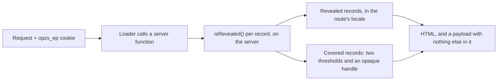
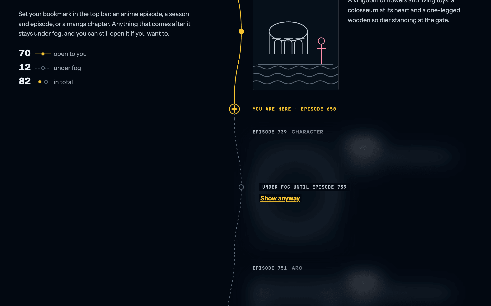
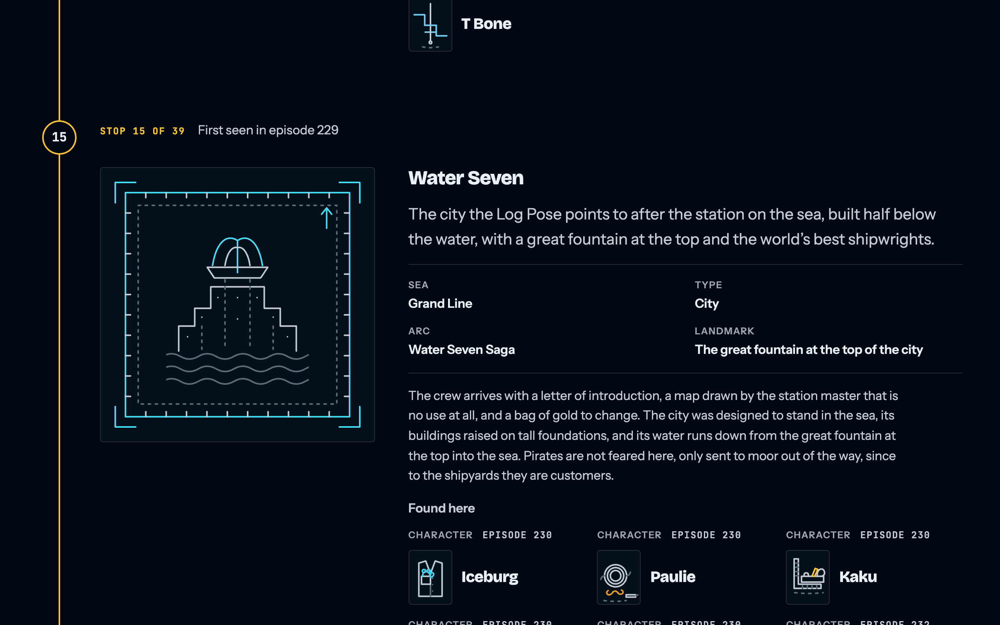

<p align="center">
  
</p>

<p align="center">
  <strong>A One Piece wiki that hides everything after the episode or chapter you have reached.</strong>
  <br>
  React 19 · TanStack Start (SSR) · StyleX · TypeScript strict · 5 runtime dependencies
</p>

<p align="center">
  <a href="https://one-piece-zero-spoiler.netlify.app/en/characters"><strong>Live demo</strong></a>
  ·
  <a href="https://github.com/cosimochellini/one-piece-zero-spoiler/releases/latest">Releases</a>
  ·
  <a href="https://github.com/cosimochellini/one-piece-zero-spoiler/actions/workflows/ci.yml">CI</a>
</p>

<p align="center">
  <a href="https://github.com/cosimochellini/one-piece-zero-spoiler/actions/workflows/ci.yml"></a>
  <a href="https://github.com/cosimochellini/one-piece-zero-spoiler/releases/latest"></a>
  <a href="https://app.netlify.com/sites/one-piece-zero-spoiler/deploys"></a>
  <a href="LICENSE"></a>
</p>

## Hidden content stays on the server

Wikis about long stories are full of spoilers. You look up one character and the
sidebar tells you who dies and who betrays whom. This one asks where you are in
the story and hides everything after that point.

Below is the same page, viewport and scroll position. Only the bookmark is
different.

| Bookmark at episode 45                                                                                                                        | Bookmark at episode 650                                                                                                        |
| --------------------------------------------------------------------------------------------------------------------------------------------- | ------------------------------------------------------------------------------------------------------------------------------ |
|  |  |

This is not a blur over a full page. The hidden names are never sent to the
browser. Ask the live site for a character you have not met yet, with no
bookmark set:

```sh
curl -s https://one-piece-zero-spoiler.netlify.app/en/characters/trafalgar-law \
  | grep -c 'Trafalgar Law'
# 0

curl -s https://one-piece-zero-spoiler.netlify.app/en/characters/trafalgar-law \
  | grep -o '<title>[^<]*</title>'
# <title>A character under fog | Zero Spoiler</title>
```

With `Cookie: opzs_ep=650` the count is `1` and the title is the name. The
server decides once, before the document is built, and the records it hides
never leave the server:


```mermaid
flowchart LR
  A["Request + opzs_ep cookie"] --> B["Loader calls a server function"]
  B --> C["isRevealed() per record, on the server"]
  C --> D["Revealed records, in the route's locale"]
  C --> E["Covered records: two thresholds and an opaque handle"]
  D --> F["HTML, and a payload with nothing else in it"]
  E --> F
```

The archive is 644 records and 645 line drawings, about 900 KB of TypeScript.
None of it is compiled into the client bundle. A route loader reads the cookie
from the request and returns the records at or below the bookmark, with their
strings already in the page's locale and their drawings already turned into
stroke paths. A record the reader has not reached is sent as two numbers and an
opaque handle:

```ts
export type CoveredRecord = {
  readonly handle: string
  readonly kind: EntityKind
  readonly revealedAtEpisode: number
  readonly revealedAtChapter: number
}
```

There is no id, because the id is the name slug: `/characters/trafalgar-law` in
a `key`, an `href` or a DOM `id` would give the name away. The handle is the
record's index in one fixed order, written in base 36, and the table that maps
indexes back to ids exists only in the server bundle.

A covered entry is a placeholder, not a blur over the real content: a plain
seal, the word "Spoiler" and the threshold. Knowing that something opens at
episode 392 is not a spoiler. The hidden text is not in the DOM, so find-in-page
cannot turn it up, and it is not in the payload either.

The cost is one round trip. Moving the bookmark used to be instant because every
record was already in the browser. Now it is a request, made inside a
`useTransition`, so the current page stays on screen until the new one is ready,
and the "you are here" line and the records around it update together.

Search follows the same rule, by construction: a covered character is not on the
page, so it cannot be found. Search matches only the epithets the reader has
already reached, so "Whitebeard" finds Edward Newgate after episode 152 and not
before. Those epithets are checked on the server and sent already folded, so an
epithet the reader has not reached is not in the browser at all.

## Screenshots

|                                                                                                                                                                                                                                 |                                                                                                                                                                                                        |
| ------------------------------------------------------------------------------------------------------------------------------------------------------------------------------------------------------------------------------- | ------------------------------------------------------------------------------------------------------------------------------------------------------------------------------------------------------ |
| <br>The landing page: open entries in gold above your position, hidden ones dashed below it. | <br>Characters: 470 in the wiki, each with its own crest.                    |
| <br>Places: one stop after another, each with a drawing and a short entry.                                                 | <br>The bookmark dialog: three ways to say where you are. |

## The archive in numbers

| Thing               | Count                                                                 |
| ------------------- | --------------------------------------------------------------------- |
| Records             | 644                                                                   |
| Characters          | 470                                                                   |
| Devil fruits        | 128                                                                   |
| Arcs, places, ships | 34 · 10 · 2                                                           |
| Sagas               | 12                                                                    |
| Line drawings       | 645: one per record, and one redrawn from episode 421                 |
| Test files          | 65                                                                    |
| Test cases          | 555                                                                   |
| Coverage            | 95.7 % statements, 93.8 % branches, 95.4 % functions (last local run) |

## Drawings

Toei and Shueisha own every frame of the anime and every panel of the manga, so
none of it is shipped or hotlinked. Every record has a line drawing made for
this project instead: a straw hat, three sheathed swords, a violin, a windmill
on a hill. There are no faces, logos or official artwork.

The drawings are data, not markup. They are lists of stroke paths in TypeScript,
and one component renders all of them: a 160×200 box, a 2 px stroke kept at 2 px
with `vector-effect: non-scaling-stroke`, round caps and joins, no fills. Each
drawing uses one hue for its main stroke and the neutral ink for the rest, which
keeps several hundred illustrations consistent as a set.

A drawing can have a date, like a fact on a character page. When the story
changes a record, it gets a new drawing from that episode on, and the server
picks the latest drawing the reader's bookmark has reached. The picture for a
character never shows something the reader has not seen yet.

The surrounding artwork works the same way. The night sea on the landing page,
the seal behind each crest, the plate on each place and the route line with its
compass mark are all stroke lists under `src/data/art/`, so no line on the site
is written in JSX. The only filled shape is the ship on the landing page: the
Thousand Sunny as a silhouette against a full moon, with a thin gold outline. At
headline size, an outline-only ship looked like a technical diagram.

The 128 devil fruits are generated rather than drawn one by one. A hundred and
twenty-seven drawings of the same kind of object have to look like one set and
still be told apart, so each is composed from a seed written next to its id: one
of six silhouettes, one of four marks, a stalk and a leaf. The eleven fruits a
reader already knows well are drawn by hand and override their generated
version. The sizing is guaranteed rather than hoped for: a seed cannot set a
radius, so the widest fruit the generator can produce is known in advance. Every
path it writes uses absolute commands only, which lets the test read the numbers
in a path as coordinates.

## Stack

| Layer     | Choice                                            |
| --------- | ------------------------------------------------- |
| UI        | React 19.3.0                                      |
| Framework | TanStack Start 1.168.52 (SSR, file-based routes)  |
| Router    | TanStack Router 1.170.35                          |
| Styling   | StyleX 0.19.0, compiled to one same-origin sheet  |
| Build     | Vite 8.3.0                                        |
| Language  | TypeScript 6.0.3, `strict` plus nine extra flags  |
| Tests     | Vitest 5.0.0, jsdom, Testing Library              |
| Lint      | ESLint 10 flat config, 1,020 rules on, type-aware |
| Gates     | react-doctor 0.9.14, fallow 3.25.0                |
| Host      | Netlify, SSR function plus CDN assets             |
| Runtime   | Node 24.18.0, npm 11.20.0                         |

**Five runtime dependencies.** Every version is pinned exactly, with no ranges
and one documented `overrides` entry.

## What the tests guarantee

The archive is TypeScript modules rather than JSON, so most mistakes are caught
before anything runs:

- `ArtId` is derived from the drawings themselves, so a record cannot name a
  drawing that does not exist.
- The English dictionary defines the key set and the Italian one is typed
  against it, so a missing translation fails `typecheck`.
- The bookmark is a discriminated union read through an exhaustive switch, under
  `noFallthroughCasesInSwitch`.
- `strict` is on with nine more flags, including `noUncheckedIndexedAccess`,
  `exactOptionalPropertyTypes` and `noPropertyAccessFromIndexSignature`. Each of
  the four `eslint-disable` comments in the codebase names its rule and gives a
  reason, because the lint rejects one that does not.

The test suite covers what the compiler cannot. These editorial rules are
checked on every run:

- nothing in a payload names a record the reader has not reached, no handle can
  be turned back into a name, and a covered record has no id. This is checked on
  all 356 of them, because a single handle that happened to be `btoa(id)` would
  undo the whole scheme;
- ids are unique, thresholds are within the allowed range, and every record is
  translated in both locales;
- each record has its own drawing, never one borrowed from another record;
- every character timeline is in ascending order and starts no earlier than the
  record's own threshold, so a fact can never come before the character it
  belongs to;
- a chronicle story names only characters that appear no later than the story's
  own episode. Both the links the server builds from `[[id]]` markers and the
  plain text around them are checked against every later record's name, in both
  locales, so a story the reader has reached never introduces someone they have
  not met;
- every place belongs to an arc that opens no later than the place itself,
  because the place page shows that arc;
- every drawing belongs to a record;
- every devil fruit opens no later than any character entry that names it, which
  lets a character page link to its fruit without checking anything. The
  eighteen fruits whose chapter threshold rounds the wrong way are pinned in a
  list, so a nineteenth has to be added on purpose.

The self-referential one: the pull request title validator reads the release
configuration and checks that both accept exactly the same commit types. If they
drifted apart, a pull request would merge cleanly and then release nothing, so
the drift fails as a test instead.

The dictionaries have a test of their own: the copy follows the
[tone-of-voice skill](.claude/skills/tone-of-voice/SKILL.md), and
`src/i18n/translate.test.ts` fails on an em dash, an exclamation mark or a
banned phrase in either language.

## Accessibility, security, performance

### Accessibility

- A skip link, and a native `<dialog>` opened with `showModal()`: top layer,
  page inert, Escape closes it, and focus returns to where it was.
- Covered content has `inert` and `aria-hidden`, so neither Tab nor a screen
  reader can reach a spoiler.
- The reader's position on the landing page chart is `aria-current="step"`.
- Contrast is measured and recorded next to the tokens: 17.4:1 for body text,
  12.2:1 for the accent.

### Security

- A per-request nonce Content Security Policy, `default-src 'self'`,
  `object-src 'none'`, `frame-ancestors 'none'`, plus HSTS, Referrer-Policy and
  Permissions-Policy.
- The headers are set in the app, not in `netlify.toml`, because Netlify does
  not apply file headers to responses from a function, and every document here
  is rendered by one.
- In CI the pull request title reaches the validator through the environment,
  never through template interpolation, because anyone opening a pull request
  controls the title.
- The server functions that serve the archive are behind a CSRF middleware, so
  another origin cannot call them on a reader's behalf.

**What the fog does and does not do.** It hides the story from someone reading
the site. It is not an access control. The "Show anyway" button is a deliberate
way out: it asks the server for one record by handle, and a script could go
through every handle on a page and rebuild the archive in a few hundred
requests. What changed is the effort that takes. It used to be one `curl` of a
cacheable, crawlable static file. Now it is same-origin POSTs to a function,
which are logged, can be rate-limited, and are not indexed by search engines.

**Search engines get the whole archive.** A crawler sends no bookmark, so
otherwise it would index four hundred and forty-six pages that all say "A
character under fog". A request whose `User-Agent` names one of fourteen known
crawlers and link previewers (Googlebot, Bingbot, Applebot, the two Yandex and
Baidu bots, the Slack, Discord and WhatsApp previewers and others) is treated as
a reader who has finished the story, and gets everything. This is a deliberate
trade-off: a user agent is a string anyone can send, so `curl -A Googlebot`
reads the whole wiki. The fog protects readers from spoilers; it does not stop
someone who wants to see everything. WhatsApp is the only name matched at the
start of the string. Its link previewer puts it first, while its in-app browser
appends the same token to a normal mobile browser's user agent, and that is a
real reader who tapped a link a friend sent.

### Performance

- **The archive is not in the bundle.** Moving it behind the loaders took the
  client JavaScript from 1,048,559 bytes to 450,058, and 318 KB of what is left
  is React. A reader at episode 45 downloads the ten records they have reached,
  not all 644. Adding the 120 devil fruits, their drawings and two more pages
  added 31 KB of client JavaScript and no archive data.
- Payloads carry one locale. A record used to ship its Italian and English name
  and summary together; now it carries only the page's language.
- The character grid on the characters page (470 tiles with a drawing each,
  below the fold) comes from the loader as a promise that is not awaited and
  streams into a `<Suspense>` boundary, so the search field and the crests above
  them load first. The landing page chart, the places list and a character page
  are awaited instead: they are the page, and a reader with scripting off should
  get them in full.
- Search runs on names folded once by the server, so a keystroke costs one
  folded query and a few hundred `indexOf` calls. The list below the field is
  deferred; the field itself never is.
- Three self-hosted variable font families in five woff2 files, each with a
  metric-matched fallback face so the `font-display: swap` switch does not
  reflow the page.
- Assets and fonts have immutable one-year cache headers. The archive's own
  responses vary by cookie and are never stored in a shared cache.

### Localization

Italian and English, as route prefixes: `/it` and `/en`. The root chooses once
(cookie, then `Accept-Language`, then Italian) and redirects with a 302, never
a 301. An unknown prefix is a 404, not a silent redirect. In Italian, character
names follow the Italian dub.

## Running it locally

Node 24.18.0 and npm 11.20.0, both pinned.

```sh
nvm use
npm install
npm run dev     # http://localhost:3000
```

`npm install` also installs the git hooks, through the `prepare` script rather
than a dependency's postinstall, so they work on a plain install without the
project allowing install scripts. `LEFTHOOK=0 git commit` skips them for one
command.

| Script                                      | Does                                            |
| ------------------------------------------- | ----------------------------------------------- |
| `npm run dev`                               | Dev server                                      |
| `npm run build`                             | Production build                                |
| `npm start`                                 | Serve the production build                      |
| `npm run typecheck`                         | `tsc --noEmit`                                  |
| `npm run lint` / `lint:fix`                 | ESLint, type-aware, zero warnings allowed       |
| `npm run format` / `format:check`           | Prettier                                        |
| `npm test` / `test:watch` / `test:coverage` | Vitest                                          |
| `npm run gate:react-doctor`                 | Blocking react-doctor health gate               |
| `npm run gate:fallow`                       | Blocking fallow codebase-intelligence gate      |
| `npm run gate:archive`                      | Blocking gate: the archive is not in the bundle |
| `npm run check`                             | All of the above, in the order CI runs it       |

`npm run check` is the gate. Run it before pushing.

The hooks run before it, not instead of it: `pre-commit` formats and lints the
staged files and typechecks the whole project, `commit-msg` runs commitlint, and
`pre-push` runs the test suite. Each one covers part of what `npm run check`
does, and CI skips all three with `LEFTHOOK=0` because it runs the full check
anyway.

## Engineering notes

**The pull request title sets the version bump.** Merges to `main` are squashed
into one commit whose subject is the title, and semantic-release reads that
subject to create the tag and the GitHub Release. Every conventional type maps
to a release on purpose, so every merged pull request produces a version. There
is no `CHANGELOG.md`; the Releases page is the changelog.

**Three blocking gates beyond lint and test.** react-doctor and fallow run last,
after typecheck, lint, format, test and build, both locally and in CI, and
neither can be skipped. Every react-doctor finding blocks, whatever its tag. Its
configuration is a typed `doctor.config.ts`, and it runs with inline disables
ignored, so a comment cannot get a finding past the gate.

The third gate is `scripts/archive-gate.mjs`. It exists because nothing else can
see the problem it looks for: one stray value import from `~/data` typechecks,
lints, passes every test and passes both other gates, and the only symptom is a
bigger `.js` file that a visitor with no bookmark can read end to end. The gate
searches the built client chunks for a sentence from every saga and from the
places list, read when the gate runs so it cannot go stale. It never searches
for a key such as `revealedAtEpisode`, which is legitimately present on a
covered record. The drawing modules contain no sentences; they are keyed by
record id, and a record's id is its name slug, so the gate looks for those ids
instead, since that is how a leak there would show up. A byte limit on the whole
client payload catches anything large that neither pattern matches. ESLint
catches the same mistake earlier, at the import.

fallow checks the structure of the codebase instead, with nearly every rule set
to error: eight zones with a declared import direction between them, no
duplicated block of eight lines or more, and limits of 8 cyclomatic, 8 cognitive
and 60 lines per unit. Both gates write a machine-readable report that CI
uploads as an artifact on every run, passing or failing.

**A thousand rules, not four presets.** `eslint --print-config` on a source file
reports 1,020 rules switched on. Most of them come from unicorn (328) and
sonarjs (216), followed by typescript-eslint's type-aware sets, `@eslint-react`,
regexp, jsdoc and jsx-a11y-x. `eslint-config-prettier` is applied last, so the
two tools never disagree about formatting. On top of these are explicit limits:
complexity 8, cognitive complexity 10, 60 lines per function, 300 per file, 15
statements, 3 parameters, 3 levels of nesting. They are sized for what a
reviewer can hold in their head at once, not as a target to grow into. A
suppression has to justify itself: `require-description` means an
`eslint-disable` names its rule and gives a reason, and `no-unused-disable`
fails it once the reason no longer applies. There are four in the codebase.

**The commit type list is defined once.** The hooks run through lefthook: one
declarative file with globs, `{staged_files}` and re-staging built in, instead
of a shell script per hook plus lint-staged. `commit-msg` runs the message
through commitlint, and commitlint's config imports `TYPE_BUMPS` and
`MAX_TITLE_LENGTH` from `scripts/validate-pr-title.mjs` instead of repeating
them. The header limit is the pull request title limit, because a squash merge
turns that title into the commit subject. The validator is itself tested against
`.releaserc.json`, so all three stay in sync by construction, and a parity test
runs the same commitlint binary the hook uses to check that the import is what
the tool actually enforces.

**Two Vite configs, on purpose.** The Vitest config leaves out the TanStack
Start plugin, which forces `optimizeDeps.include` for React. Under Vitest that
prebundles a second copy of React and breaks hooks. Vitest uses its own config
instead of merging the two, so the separation is real. StyleX has to be
registered in both, because its `create` throws at runtime when it has not been
compiled.

**One dependency override.** StyleX's plugin and TanStack's router plugin
declare non-overlapping peer ranges for `unplugin`, so a clean install fails
with `ERESOLVE`. The override pins every copy to the version TanStack already
requires. It can be removed once StyleX widens its range.

## Built with Claude Code

This project was built in agentic sessions with
[Claude Code](https://claude.com/claude-code). What matters is not that a model
wrote the code, but that the guardrails came first, so its output could be
accepted or rejected by checks rather than on trust.

Nothing reaches `main` without passing a type-aware lint of over a thousand
rules with zero warnings, the full test suite including the editorial rules
above, a production build, and three blocking quality gates. Pull requests go
through review loops run by subagents, and every finding is either fixed in the
same pull request or filed as an issue. The release configuration is checked by
a test as well.

The text on the site and in this README follows the
[tone-of-voice skill](.claude/skills/tone-of-voice/SKILL.md), so an agent
editing copy gets the same rules a person would.

For the same reason, architecture decisions are documented in code comments next
to the code they explain, and this README stays short.

## Next

- [ ] Verify the manga chapter thresholds against a source. They were entered
      from memory and are marked for a check.
- [ ] More places with full pages: 10 places have one today, across 34 arcs.
- [ ] Chronicles for the rest of the featured characters: 12 of the 36 have one
      today, the crew and the two key figures of the first half of the story.
      The episode each story opens at is recorded in
      [`docs/chronicle-verification.md`](docs/chronicle-verification.md).

## License

[MIT](LICENSE) © 2026 Cosimo Chellini.

One Piece is created by Eiichiro Oda and owned by Shueisha and Toei Animation.
This is an unofficial, non-commercial fan project. It contains no official
artwork, scans or frames, and it is not endorsed by the rights holders.

Built by [Cosimo Chellini](https://github.com/cosimochellini).
