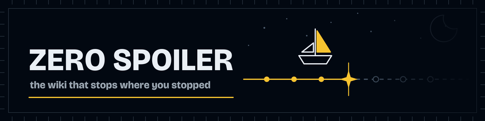
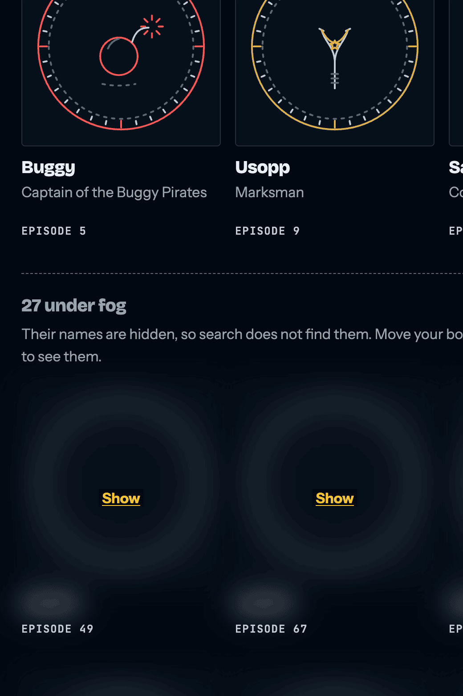
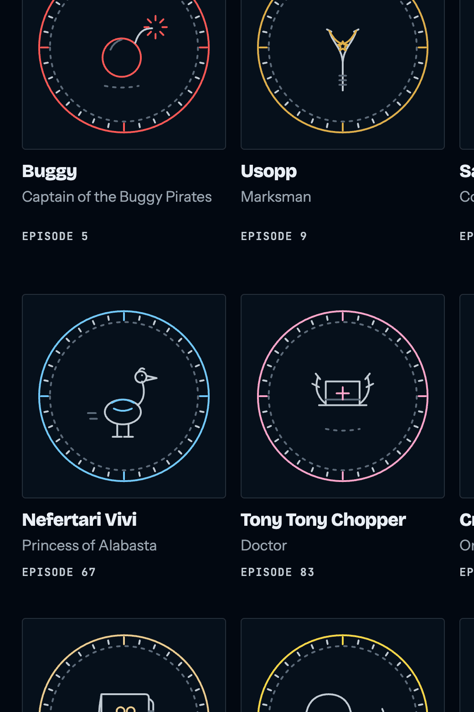
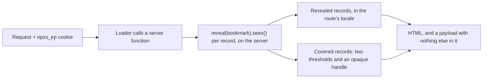
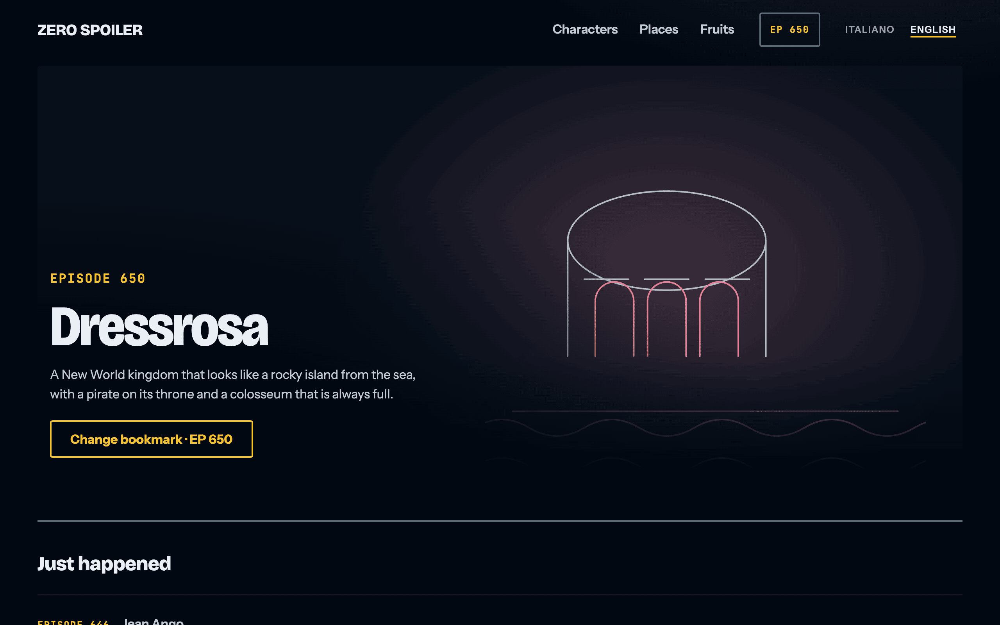
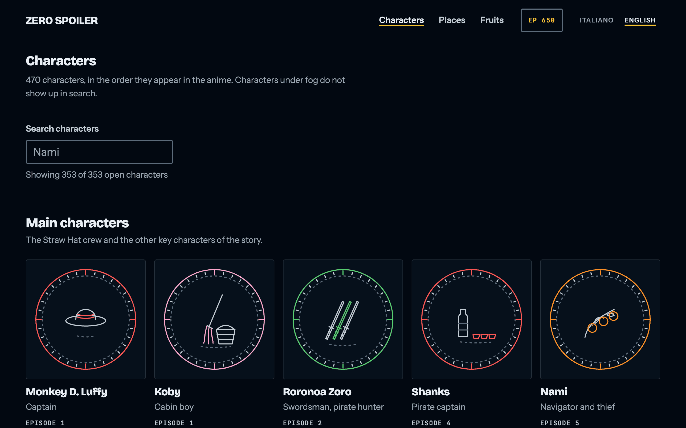
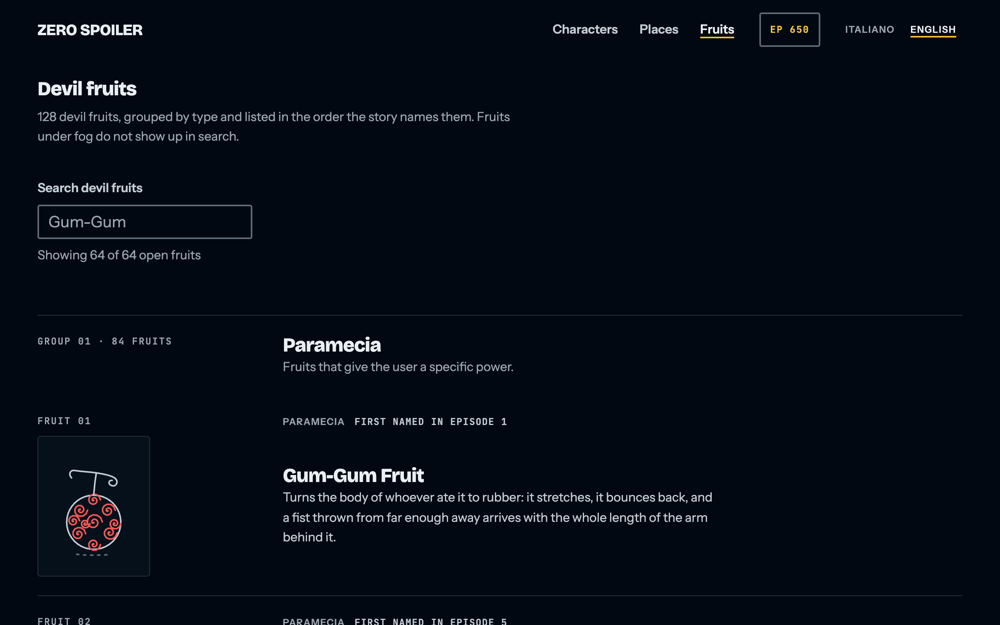
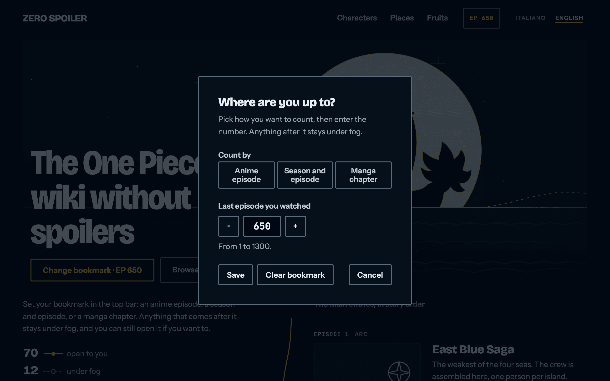

<p align="center">
  
</p>

<h1 align="center">Zero Spoiler</h1>

<p align="center">
  <strong>The One Piece wiki without spoilers.</strong>
  <br>
  Set a bookmark at the last episode or chapter you reached. Everything after it stays on the server.
</p>

<p align="center">
  <a href="https://one-piece-zero-spoiler.netlify.app/en"><strong>Open the wiki</strong></a>
  ·
  <a href="CONTRIBUTING.md">Contribute</a>
  ·
  <a href="docs/architecture.md">How it works</a>
</p>

<p align="center">
  <a href="https://github.com/cosimochellini/one-piece-zero-spoiler/actions/workflows/ci.yml"></a>
  <a href="https://github.com/cosimochellini/one-piece-zero-spoiler/releases/latest"></a>
  <a href="https://app.netlify.com/sites/one-piece-zero-spoiler/deploys"></a>
  <a href="https://github.com/cosimochellini/one-piece-zero-spoiler/issues?q=is%3Aissue+is%3Aopen+label%3A%22good+first+issue%22"></a>
  <a href="LICENSE"></a>
</p>

## Same page, two bookmarks

Look up one character on a normal wiki and the sidebar tells you who dies and
who betrays whom. Here you set a bookmark, and every entry after it is under
fog.

| Bookmark at episode 45                                                                                                                        | Bookmark at episode 650                                                                                                        |
| --------------------------------------------------------------------------------------------------------------------------------------------- | ------------------------------------------------------------------------------------------------------------------------------ |
|  |  |

## Hidden entries never reach the browser

The fog is not a blur over the full page. Ask the live site for a character you
have not met yet, with no bookmark set:

```sh
curl -s https://one-piece-zero-spoiler.netlify.app/en/characters/trafalgar-law \
  | grep -c 'Trafalgar Law'
# 0

curl -s https://one-piece-zero-spoiler.netlify.app/en/characters/trafalgar-law \
  | grep -o '<title>[^<]*</title>'
# <title>A character under fog | Zero Spoiler</title>
```

With `Cookie: opzs_ep=650` the title is the name. The server reads the bookmark
before it builds the page. An entry you have not reached is sent as its kind,
two thresholds and an opaque handle, with no name, no id and no text:


```mermaid
flowchart LR
  A["Request + opzs_ep cookie"] --> B["Loader calls a server function"]
  B --> C["reveal(bookmark).sees() per record, on the server"]
  C --> D["Revealed records, in the route's locale"]
  C --> E["Covered records: two thresholds and an opaque handle"]
  D --> F["HTML, and a payload with nothing else in it"]
  E --> F
```

The archive is never compiled into the client bundle, and a build gate fails if
any of it gets there. Search, drawings and links follow the same rule. The full
design is in [docs/architecture.md](docs/architecture.md).

## What's inside

500+ characters, 120+ devil fruits and about 40 places, from the first episode
to the latest arc, in Italian and English. Every entry has its own line drawing
made for this project, and some are redrawn from the episode the story changes
them. There is no official artwork.

|                                                                                                                                                                                              |                                                                                                                                                                                                        |
| -------------------------------------------------------------------------------------------------------------------------------------------------------------------------------------------- | ------------------------------------------------------------------------------------------------------------------------------------------------------------------------------------------------------ |
| <br>The landing page: the arc you are in, and what just happened. | <br>Characters: each one with its own crest.                    |
| <br>Devil fruits: grouped by type, in the order the story names them.  | <br>The bookmark dialog: three ways to say where you are. |

## Run it

Node 24.21 and npm 12.2, as set in `.nvmrc` and `packageManager`.

```sh
nvm use
npm install
npm run dev     # http://localhost:3000
npm run check   # everything CI runs: types, lint, format, tests, build, gates
```

## Contribute

The most useful contributions need no code:

- **A wrong episode or chapter.** An entry that opens too early is a spoiler,
  the one bug this project cannot ship. Open a
  [content issue](https://github.com/cosimochellini/one-piece-zero-spoiler/issues/new?template=content.yml)
  with a source.
- **A redrawing.** Some characters change during the story, and their drawing
  should change with them. Each one is a
  [good first issue](https://github.com/cosimochellini/one-piece-zero-spoiler/issues?q=is%3Aissue+is%3Aopen+label%3A%22good+first+issue%22)
  with a checklist.
- **Stories, places and devil fruits** that the wiki does not have yet.

[CONTRIBUTING.md](CONTRIBUTING.md) explains where each kind of entry lives,
which tests guard it and how pull requests are released.

## Stack

React 19 · TanStack Start (SSR) · StyleX · TypeScript `strict` · Vite · Vitest ·
Netlify. Six runtime dependencies, each pinned to an exact version.

## Built with Claude Code

This project was built in agentic sessions with
[Claude Code](https://claude.com/claude-code). The checks came first: a
type-aware lint of over a thousand rules, tests that scan every text for names
the reader has not reached, a production build and three blocking gates. Code
from a person or an agent is accepted by those checks, not on trust, and copy
from either follows the same
[tone-of-voice skill](.claude/skills/tone-of-voice/SKILL.md).

## License

[MIT](LICENSE) © 2026 Cosimo Chellini.

One Piece is created by Eiichiro Oda and owned by Shueisha and Toei Animation.
This is an unofficial, non-commercial fan project. It contains no official
artwork, scans or frames, and it is not endorsed by the rights holders.
